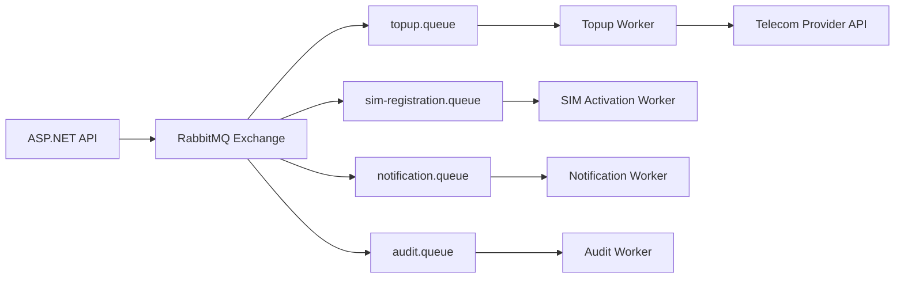

# FABU Production Deployment Runbook

## Files Added

- `src/backend/Dockerfile`: ASP.NET production image.
- `src/frontend/Dockerfile`: Next.js standalone production image.
- `docker-compose.yml`: production stack.
- `nginx/nginx.conf`: Nginx base config.
- `nginx/conf.d/fabu.conf`: web/API reverse proxy.
- `.env.production`: production environment template with placeholders.
- `.github/workflows/deploy.yml`: CI/CD pipeline.
- `scripts/*.sh`: deploy, backup, restore, healthcheck, SSL, rollback.
- `monitoring/*`: Prometheus and Grafana provisioning.

## Backend Dockerfile

The backend Dockerfile uses:

- `mcr.microsoft.com/dotnet/sdk:8.0-alpine` for restore/build/publish.
- `mcr.microsoft.com/dotnet/aspnet:8.0-alpine` for runtime.
- Release publish with `/p:UseAppHost=false`.
- Non-root Linux user `fabu`.
- `ASPNETCORE_ENVIRONMENT=Production`.
- `ASPNETCORE_URLS=http://+:8080`.
- Docker health check against `/health`.

The project currently targets `net8.0`. If the backend is upgraded to `net9.0`, switch both base images from `8.0-alpine` to `9.0-alpine`.

## Frontend Dockerfile

The frontend Dockerfile uses:

- Node 22 Alpine.
- `npm ci` for deterministic install from `package-lock.json`.
- Next.js `output: "standalone"`.
- Non-root user `nextjs`.
- Runtime copies only `public`, `.next/standalone`, and `.next/static`.
- Health check against `http://127.0.0.1:3000`.

## First Deployment

On the server:

```bash
cd /opt/fabu
cp .env.production.example .env.production
nano .env.production
chmod +x scripts/*.sh
```

Build and start:

```bash
./scripts/deploy.sh
```

Initialize Let's Encrypt:

```bash
./scripts/init-letsencrypt.sh
```

Run health check:

```bash
./scripts/healthcheck.sh
```

## Environment Variables

Important backend variables:

- `ConnectionStrings__DefaultConnection`: database connection string.
- `Jwt__Key`: at least 64 random characters.
- `Jwt__Issuer`: token issuer.
- `Jwt__Audience`: token audience.
- `AuthSecurity__CookieSecure`: must be `true` in HTTPS production.
- `RedisConfiguration__Connection`: Redis host/password.
- `Serilog__WriteTo__1__Args__serverUrl`: Seq URL.
- `Sms__*`: external telecom/SMS integration values.
- `VNPay__*`, `PayPal__*`, `Stripe__*`: payment providers.

Important frontend variable:

- `NEXT_PUBLIC_API_URL`: public API base URL, usually `https://api.fabu.company.com`.

## CI/CD Flow

GitHub Actions pipeline:

1. Restore backend packages.
2. Build backend.
3. Run backend tests if test projects exist.
4. Install frontend dependencies.
5. Lint frontend.
6. Build frontend.
7. Build Docker images.
8. Push images to GHCR.
9. SSH into VPS.
10. Update `IMAGE_TAG`.
11. `docker compose up -d`.
12. Run health check.
13. Roll back to previous `IMAGE_TAG` if health check fails.

Required GitHub secrets:

- `VPS_HOST`
- `VPS_USER`
- `VPS_SSH_KEY`
- `VPS_SSH_PORT` optional

The server must already contain `/opt/fabu/.env.production` with real secrets.

## PostgreSQL Backup

Manual backup:

```bash
cd /opt/fabu
./scripts/backup-postgres.sh
```

Restore:

```bash
cd /opt/fabu
./scripts/restore-postgres.sh backup/postgres/fabu-postgres-YYYYMMDDTHHMMSSZ.dump
```

Backup format is custom `pg_dump -Fc`, suitable for `pg_restore`.

## Redis

Use Redis for:

- distributed cache,
- query result cache,
- OTP/session-like short-lived values,
- rate-limit counters if implemented later.

Redis is useful for FABU because data plans, profile summaries, dashboard read models, and telecom API metadata are read-heavy.

## RabbitMQ

Use RabbitMQ for:

- topup queue,
- SIM registration queue,
- notification queue,
- audit queue.

Recommended message flow:



Add dead-letter queues for provider timeout, invalid payload, and max retry exceeded.

## Logging With Serilog and Seq

Production config sends logs to console and Seq. Use structured fields:

```csharp
logger.LogInformation(
    "Topup transaction created. TransactionRef={TransactionRef} Phone={Phone} Amount={Amount}",
    transactionRef,
    maskedPhone,
    amount);
```

Log these business events:

- login success/failure,
- SIM registration created,
- SIM activation success/failure,
- topup transaction created,
- telecom provider request failed,
- payment callback received,
- permission denied,
- critical exception.

Do not log:

- raw password,
- OTP,
- full JWT,
- payment secret,
- full telecom provider credential.

## Monitoring

Prometheus currently scrapes:

- node-exporter: CPU, RAM, disk, network,
- cAdvisor: Docker container usage,
- postgres-exporter: PostgreSQL health and activity,
- redis-exporter: Redis health and memory,
- Prometheus itself.

Grafana auto-loads `FABU Production Overview`.

For ASP.NET request duration/error metrics, add `prometheus-net.AspNetCore` or OpenTelemetry later, then expose `/metrics` and add a Prometheus scrape target.
