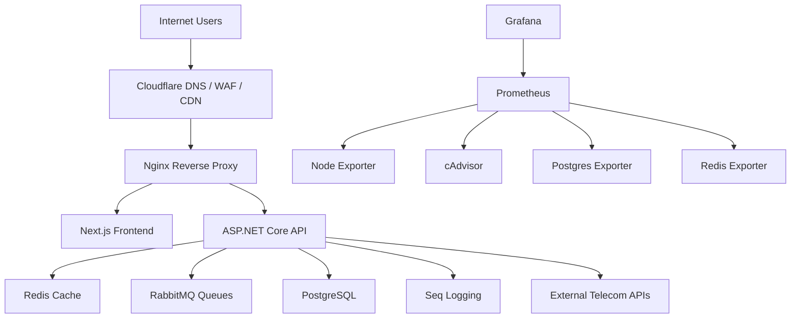

# FABU Production Architecture

FABU should be deployed as a Modular Monolith first, not as early microservices.

Reasoning:

- The current backend already follows Clean Architecture with `Api`, `Application`, `Domain`, `Infrastructure`, and `Persistence`.
- CQRS/MediatR behavior exists in the application layer, so command/query separation can grow inside one deployable unit.
- Telecom workflows such as SIM registration, topup, customer profile, payment, and audit need transactional consistency.
- Microservices would add distributed transactions, message versioning, network failures, and operations cost before the product needs them.

Recommended evolution:

1. Production Modular Monolith: ASP.NET API + Next.js + PostgreSQL + Redis + RabbitMQ.
2. Extract workers later: topup worker, SIM activation worker, notification worker.
3. Extract services only after clear domain boundaries and independent scaling pressure appear.

## High-Level Diagram

## Core Flows

Authentication flow:

1. User opens `fabu.company.com`.
2. Next.js calls `api.fabu.company.com`.
3. Nginx applies HTTPS, security headers, and auth rate limits.
4. ASP.NET validates credentials, issues access token and refresh token.
5. Secure cookies or bearer token are used for later API calls.
6. Login events are written to Serilog/Seq.

SIM registration flow:

1. Agent/customer submits SIM registration.
2. API validates identity, number, and required fields.
3. Database transaction stores registration request and audit log.
4. RabbitMQ can enqueue activation/integration work.
5. Worker or API calls telecom provider.
6. Result is persisted and visible in activation history.

Topup flow:

1. Customer submits phone number, amount, payment method, optional coupon.
2. API creates transaction with pending status.
3. RabbitMQ topup queue should process external telecom call when implemented.
4. Transaction status changes to success/failed.
5. Audit log and structured Seq log are written.

External telecom API flow:

1. API/worker calls provider through typed HTTP client.
2. Use timeout, retry with jitter, idempotency key, and circuit breaker.
3. Store provider request/response reference, not sensitive payloads.
4. Failed calls are retried through RabbitMQ dead-letter handling.

Logging flow:

1. API writes structured logs with correlation IDs.
2. Serilog sends logs to console and Seq.
3. Docker keeps stdout for emergency inspection.
4. Audit events are stored separately for business traceability.

Monitoring flow:

1. Prometheus scrapes host/container/PostgreSQL/Redis exporters.
2. Grafana visualizes CPU, RAM, disk, container, PostgreSQL, and Redis.
3. API `/health` is used by Docker and Nginx health checks.
4. Add ASP.NET Prometheus instrumentation later for request latency and error-rate panels.

## VPS Sizing

These numbers assume one production node, Docker Compose, Nginx, Next.js, ASP.NET API, PostgreSQL, Redis, RabbitMQ, Seq, Prometheus, and Grafana.

| Concurrent users | CPU | RAM | SSD | Bandwidth | Estimated monthly cost |
| --- | ---: | ---: | ---: | ---: | ---: |
| 100 | 2 vCPU | 4 GB | 80 GB NVMe | 2 TB | 20-40 USD |
| 500 | 4 vCPU | 8 GB | 160 GB NVMe | 4 TB | 45-90 USD |
| 1,000 | 8 vCPU | 16 GB | 320 GB NVMe | 6 TB | 100-180 USD |
| 5,000 | 16-32 vCPU | 64 GB | 1 TB NVMe | 10 TB+ | 350-900 USD |

For 5,000 concurrent users, split database to managed PostgreSQL or a dedicated DB server. Keep Nginx/frontend/API horizontally scalable behind Cloudflare or a load balancer.

## Database Reality Check

The production task specifies PostgreSQL. The current backend code uses:

- `Microsoft.EntityFrameworkCore.SqlServer`
- `UseSqlServer(...)`
- SQL Server-specific EF migrations

The Docker stack is prepared for PostgreSQL because that is the target architecture, but the backend provider must be migrated before real PostgreSQL production traffic:

1. Add `Npgsql.EntityFrameworkCore.PostgreSQL`.
2. Replace `UseSqlServer` with `UseNpgsql`.
3. Regenerate migrations for PostgreSQL or create a clean PostgreSQL migration baseline.
4. Run migration on staging first.
5. Only then point production at PostgreSQL.

Do not run a SQL Server EF provider against a PostgreSQL connection string. It may start, but database access will fail.
